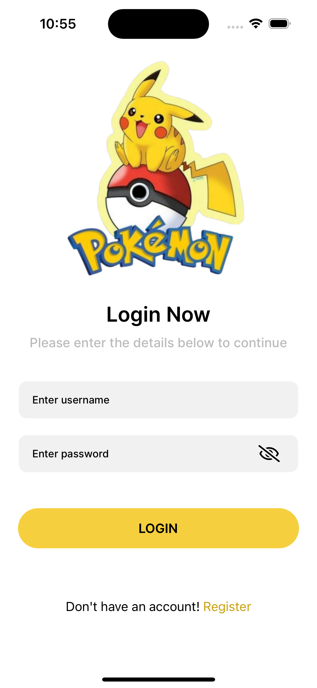
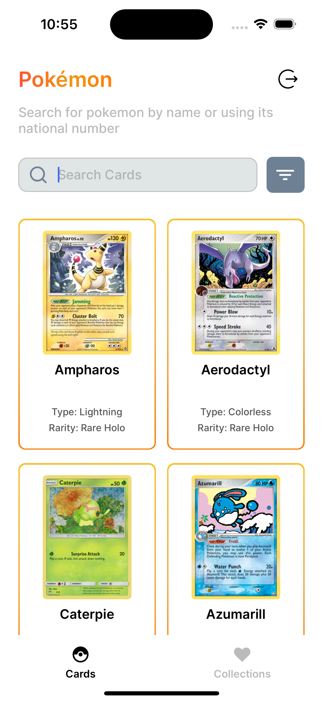
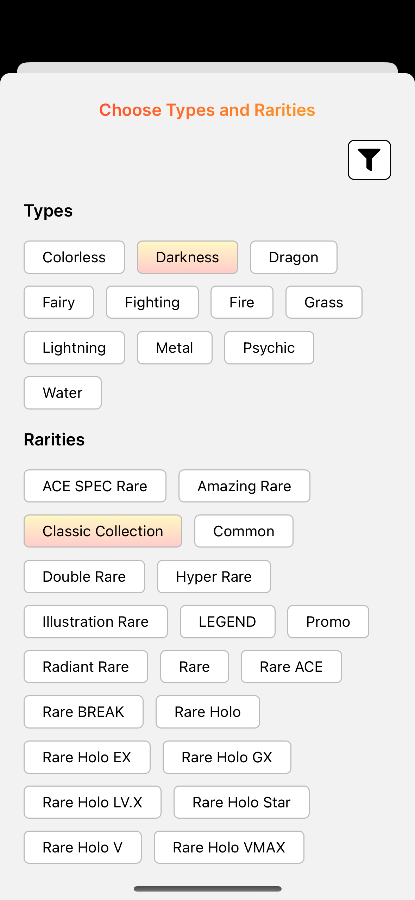
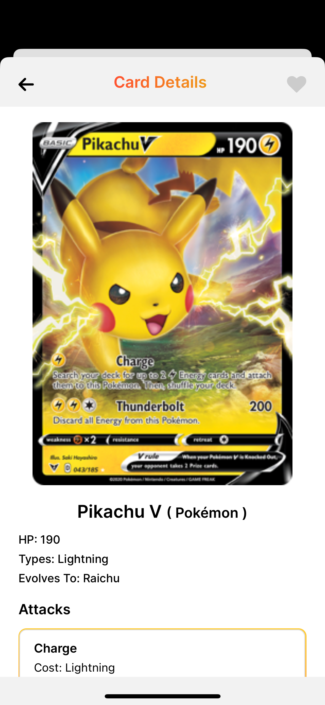
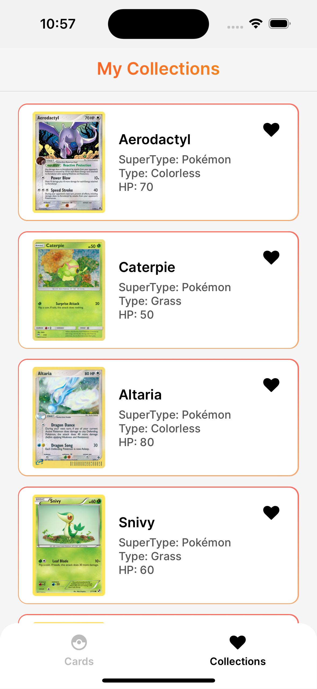

# 🎴 Pokémon Card Collection App

Welcome to the **Pokémon Card Collection App**! This app allows users to browse and manage their Pokémon card collection. You can search, filter, and view details for each card while managing your personal collections.

✨ Built using **React Native** with **Expo** to ensure a smooth and responsive experience!

## 🚀 Features

- 🔒 **Local Authentication Flow:** Secure login and signup screens.
- 🎴 **Card Screen:**
  - 🃏 View a list of Pokémon cards with **pagination**.
  - 🔍 **Search cards** by name and filter by type.
  - 📝 View detailed information for each card.
  - 📥 **Add to collections** and 📤 **remove from collections**.

## 📸 Screenshots

<p align="center">
  
  
  
  
  
</p>

## 🛠️ Tech Stack

- **[Expo](https://expo.dev/):** 🚀 Framework for building native apps.
- **[Expo Prebuild](https://docs.expo.dev/workflow/prebuild/):** Generate native iOS and Android code.
- **[Expo Router](https://expo.github.io/router/docs/):** 🧭 Intuitive navigation for managing routes.
- **[Expo Vector Icons](https://docs.expo.dev/guides/icons/):** 🎨 For beautifully styled icons.
- **[React Query (TanStack)](https://tanstack.com/query/v4):** 🗂️ Efficient API fetching and caching.
- **[MMKV Storage](https://github.com/mrousavy/react-native-mmkv):** ⚡ Super-fast local storage.
- **[Zustand](https://zustand-demo.pmnd.rs/):** 🐻 Lightweight and powerful state management.
- **[React Native Toast Message](https://github.com/calintamas/react-native-toast-message):** 🍞 For elegant toast notifications.
- **[React Native Size Matters](https://github.com/nirsky/react-native-size-matters):** 📐 Ensure your app looks great on all screen sizes.

## 📦 Setup and Installation

1. Clone this repository:
    ```bash
    git clone https://github.com/Htoomyat99/Pokemon
    ```

2. Install the dependencies:
    ```bash
    npm install
    ```

3. For iOS, generate native code and run the app:
    ```bash
    npx expo run:ios
    ```

4. For Android, generate native code and run the app:
    ```bash
    npx expo run:android
    ```

## 🌐 API

This app fetches card data from the [Pokémon TCG API](https://docs.pokemontcg.io/). The API is used for:
- 📜 Fetching cards with **pagination**.
- 🔍 **Searching** cards by name.
- 🎨 **Filtering** cards by type.
- 📝 Viewing detailed card information.

## 🎯 Functionality

### 🔐 Local Authentication Flow
- Secure authentication with **signup** and **login** functionalities.

### 🎴 Card Screen
- **Search & Filter:** Instantly search for cards by name and filter them by type.
- **Pagination:** Smoothly scroll through pages of cards.
- **Card Detail:** Tap on any card to view its full details.
- **Collections:** Easily manage your card collections by adding or removing cards.

## 📝 License

This project is licensed under the MIT License.

---

🌟 **Happy Collecting!** 🌟
